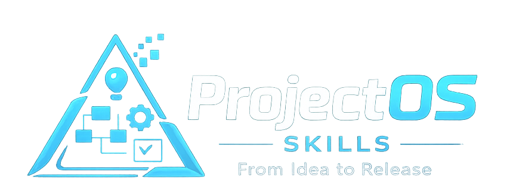

<div align="center">



# ProjectOS Skills

**A local project routing system for solo builders and AI coding agents.**

[English](README.md) | [简体中文](README.zh-CN.md)


**Idea -> PRD -> UI MVP -> Architecture -> Execution -> Re-route**

```bash
curl -fsSL https://raw.githubusercontent.com/biblehs/projectos-skills/main/install.sh | bash
```

</div>

---

ProjectOS Skills is a local, non-linear project routing system for AI-assisted development.

It helps a solo builder or vibecoder move from:

- idea
- product foundation
- first UI direction
- architecture foundation
- local execution planning

without manually choosing a skill at every stage.

It is also useful when working with multiple coding agents: ProjectOS gives each agent a shared local project protocol before work begins and a note-refresh loop after meaningful changes land.

## v0.1 Public Preview

ProjectOS Skills is a local open-source routing layer for AI-assisted project development. It helps a builder guide one or more AI coding agents from product thinking into scoped implementation with clearer PRD, UI MVP, architecture, and execution planning.

v0.1 focuses on:

- turning an idea into a usable PRD and MVP boundary
- strengthening the first UI MVP before code begins
- defining AI, data, auth, env, and runtime boundaries
- controlling implementation scope and validation
- keeping local project notes clear as the project evolves
- re-routing after each meaningful project change instead of forcing a fixed pipeline

v0.1 is intentionally limited to the workflow layer. This repository documents the current open-source skill behavior and avoids defining work outside this repo.

## Skill System

ProjectOS currently includes 19 local skills. That count is intentional: the system needs enough focused capability modules to guide a project from idea to implementation.

The user should not manually pick among 19 skills. The practical interface is:

```text
Start with project-guide.
Let ProjectOS route the next step.
```

### User-Facing Entry

| Skill | Purpose |
|---|---|
| `project-guide` | Main entrypoint. Reads project state and recommends the next best step. |

### Guided Layers

These are the main layers `project-guide` can route into:

| Skill | Purpose |
|---|---|
| `product-foundation` | Builds or refreshes PRD, module boundaries, UI MVP, first-screen direction, and design boundaries. |
| `system-foundation` | Defines AI, data, auth, env, and runtime boundaries for implementation. |
| `execution-control` | Creates a local project master, focused sprint, and implementation-mode guardrails. |
| `project-alignment` | Keeps local decisions, project notes, and release notes consistent after meaningful edits. |

### Internal Capability Modules

The remaining skills live under `internal/`. They are installed locally so ProjectOS can use them when needed, but users do not need to choose them directly.

## How Users Start

The user should not choose from a long list.

They can start with a normal idea:

```text
I want to build an AI financial management tool.
```

The system should start with `project-guide`.

`project-guide` judges:

- current project phase
- PRD readiness
- the single best next guided layer

Default new-project flow:

```text
project-guide
-> product-foundation
-> project-guide
-> system-foundation
-> execution-control
-> project-alignment
```

This is guidance, not a rigid pipeline. `project-guide` should re-route based on actual project state.

## Non-Linear And Multi-Agent Use

ProjectOS is not a waterfall process. The default chain is only a starter path for a new project.

In real work, the loop is:

```text
project-guide
-> choose the next guided layer
-> run focused product, design, system, or execution work
-> refresh local notes after meaningful changes
-> return to project-guide
```

For multi-agent development, use ProjectOS as a shared local protocol:

- define product truth and UI MVP before assigning agents
- give each agent a small scoped task from `execution-control`
- keep AI, data, auth, env, and runtime assumptions in `system-foundation`
- run `project-alignment` after important changes so later agents do not work from stale context

## UI MVP Gate

Many builders get stuck between PRD and frontend. v0.1 makes UI MVP a first-class gate before implementation.

`product-foundation` should define:

- the primary product surface from the product's core objects and user jobs, such as ledger, planner, calendar, timeline, editor, map, chat, workflow board, review queue, canvas, or hybrid
- the first screen and first validating flow
- required UI states: empty, loading, normal, error, completed, blocked, or review
- the main interaction model
- a visual thesis with mood, material, density, and energy
- color, typography, and motion direction
- reference-site adaptation when the user provides websites or screenshots
- explicit UI non-goals
- design acceptance criteria before coding starts

The goal is not to create a full design system or copy someone else's brand. The goal is to help an AI agent produce a focused, visually coherent MVP from product intent and, when provided, legally safer visual references.

## Implementation Loop

When real code work begins, `execution-control` should define one implementation task with scope, non-goals, related modules, and validation checks.

After meaningful implementation work, `project-alignment` should update local project notes:

- did the PRD change?
- did the UI MVP change?
- did AI, data, auth, env, or runtime assumptions change?
- did sprint, milestone, release scope, or risk change?
- what should `project-guide` recommend next?

Every implementation task should leave the next local project step clear.

## Open Source Scope

ProjectOS Skills is a local open-source routing system for solo builders using AI coding agents.

This repository focuses on:

- skill workflows
- document protocols
- PRD, UI MVP, system, execution, change, and release templates
- routing logic that helps the user know what to do next

It stays focused on local skill files, local project documents, and agent guidance.

## Repository Layout

```text
projectos-skills/
  README.md
  LICENSE
  project-guide/
  product-foundation/
  system-foundation/
  execution-control/
  project-alignment/
  internal/
    core-prd/
    module-prd/
    ui-mvp/
    ai-pipeline/
    data-auth-env/
    project-master/
    sprint-manager/
    worktrack-manager/
    decision-log/
    change-tracker/
    feedback-review/
    release-readiness/
    design-sync/
    project-operating-system/
  docs/
    FIRST_RUN_FLOW.md
    SKILL_SYSTEM_MAP.md
    SKILL_USAGE_ZH.md
    assets/
```

The root stays small on purpose. Internal capability skills are preserved under `internal/` so users can install the full system without having to navigate a crowded top-level folder.

## Install

Install the complete 19-skill local system with one command:

```bash
curl -fsSL https://raw.githubusercontent.com/biblehs/projectos-skills/main/install.sh | bash
```

This installs `project-guide`, the four guided layer skills, and the internal capability modules they use.

If you only want the five visible entry/layer skills, use:

```bash
curl -fsSL https://raw.githubusercontent.com/biblehs/projectos-skills/main/install.sh | bash -s -- --public
```

## Skill Logic

Use `project-guide` first when the next step is unclear.

Route to `product-foundation` when:

- the product is still idea-level
- the PRD is vague
- module boundaries are unclear
- the MVP surface is too broad

Route to `system-foundation` when:

- AI behavior affects the product
- data, auth, env, billing, or runtime complexity is real
- implementation is blocked by unclear system boundaries

Route to `execution-control` when:

- the product exists but the project needs a focused first sprint
- priorities are scattered
- the next implementation task needs scope and validation

Route to `project-alignment` when:

- meaningful changes landed
- local project notes need to be refreshed
- decisions need to be recorded
- release notes or launch checklist need a light pass

## Docs

- [First Run Flow](docs/FIRST_RUN_FLOW.md)
- [Skill System Map](docs/SKILL_SYSTEM_MAP.md)
- [中文说明](README.zh-CN.md)

## License

MIT
