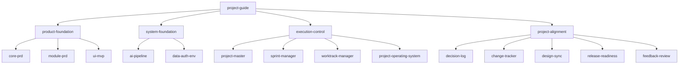

# Skill System Map

This document describes the v0.1 local ProjectOS skill system.

ProjectOS is allowed to have many skills because the user should not have to choose them manually. The operating principle is:

```text
One entrypoint.
Four guided layers.
Fourteen internal capability modules.
```

## User-Facing Entry

- `project-guide`

`project-guide` reads local project state, judges the current phase, and recommends the next guided layer.

## Guided Layers

- `product-foundation`
- `system-foundation`
- `execution-control`
- `project-alignment`

These are the layers the user may see in normal conversation.

## Internal Capability Modules

These modules live under `internal/`. They are installed locally so ProjectOS can use them as needed, but they are not meant to become a menu the user must understand.

| Layer | Internal modules |
|---|---|
| `product-foundation` | `core-prd`, `module-prd`, `ui-mvp` |
| `system-foundation` | `ai-pipeline`, `data-auth-env` |
| `execution-control` | `project-master`, `sprint-manager`, `worktrack-manager`, `project-operating-system` |
| `project-alignment` | `decision-log`, `change-tracker`, `design-sync`, `release-readiness`, `feedback-review` |

## Default Flow

```text
project-guide
-> product-foundation
-> project-guide
-> system-foundation
-> execution-control
-> project-alignment
-> project-guide
```

This is not a rigid pipeline. `project-guide` should re-route when the local project state changes.

## Mermaid


